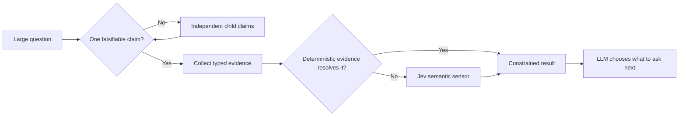

<p align="center">
  
</p>

<h1 align="center">Enzo</h1>

<p align="center"><strong>Turn big questions into small, falsifiable claims.</strong></p>

<p align="center">
  A minimal MCP server that applies decomposition pressure between an intelligent LLM and Jev.
</p>

<p align="center">
  <a href="https://github.com/mahawi1992/enzo-mcp/actions/workflows/ci.yml"></a>
  
  
  
  <a href="LICENSE"></a>
</p>

<p align="center">
  <a href="#why-enzo">Why Enzo?</a> ·
  <a href="#how-it-works">How it works</a> ·
  <a href="#quick-start">Quick start</a> ·
  <a href="#jev-response-memory">Jev memory</a> ·
  <a href="#the-three-tools">Tools</a> ·
  <a href="#example">Example</a>
</p>

> **Enzo is not another autonomous-agent framework.** The LLM keeps responsibility
> for reasoning, strategy, and deciding what to investigate. Enzo makes each next
> question precise enough to test.

## Why Enzo?

The name is inspired by the Japanese Zen **ensō** (円相), the hand-drawn circle.
Enzo uses that image as a reasoning metaphor: begin with the large circle of a
problem, then reduce it into smaller circles until each contains exactly one
independently falsifiable claim.

```text
large question → smaller question → atomic claim → evidence → semantic result
```

Most reasoning systems are comfortable producing an answer. Enzo is designed to
apply pressure before that answer exists:

| Common failure | Enzo's response |
| --- | --- |
| One question hides several claims | Decompose it into independently testable atoms |
| Missing information becomes vague confidence | Return `UNKNOWN` with the exact gap |
| Semantic judgment overrides a test | Deterministic evidence remains authoritative |
| Conclusions lose their history | Preserve evidence, provenance, revisions, and dependencies |
| A tool quietly sends context outside the process | Preview an allowlisted payload and bind the send to its SHA-256 digest |

## How it works



The responsibilities stay deliberately separate:

| Component | Responsibility |
| --- | --- |
| **LLM** | Intelligence, strategy, interpretation, and choosing the next question |
| **Enzo** | Atomicity, evidence contracts, state transitions, and decomposition pressure |
| **Jev** | Typed semantic sensing against supplied context and evidence |
| **Jev response memory** | Bounded reuse of exact approved responses without storing request state |
| **Deterministic tools** | Tests, schemas, AST inspection, type checking, and runtime measurements |

## Quick start

Requirements: Python 3.11+ and [uv](https://docs.astral.sh/uv/).

```bash
git clone https://github.com/mahawi1992/enzo-mcp.git
cd enzo-mcp
uv sync --group dev
uv run enzo-mcp
```

Jev is optional for deterministic workflows. To enable it, create a local `.env`
file containing:

```dotenv
TYPESAFE_API_KEY=your-key
```

The file is ignored by Git. Configuring a key alone never authorizes a send.
Every external observation requires an explicit field selection, a previewed
manifest, `allow_external_jev=true`, and the matching manifest SHA-256.

Run with the local key loaded when semantic sensing is needed:

```bash
uv run --env-file .env enzo-mcp
```

Exact approved Jev responses can optionally be remembered across Enzo processes.
Add a deployment-owned namespace and explicit model epoch to `.env`:

```dotenv
ENZO_JEV_CACHE_DIR=.enzo-cache
ENZO_JEV_CACHE_NAMESPACE=my-project-dev
ENZO_JEV_CACHE_MODEL_EPOCH=jev-1.13.0
ENZO_JEV_CACHE_TTL_SECONDS=86400
ENZO_JEV_CACHE_MAX_ENTRIES=10000
```

The directory is ignored by Git. Use a new model epoch whenever the effective Jev
model changes; do not use the moving `jev-latest` alias as an epoch.

### Add Enzo to Codex

Add this to `~/.codex/config.toml`, replacing the path with your checkout:

```toml
[mcp_servers.enzo]
command = "uv"
args = ["run", "--env-file", ".env", "enzo-mcp"]
cwd = "/absolute/path/to/enzo-mcp"
```

Restart Codex. Enzo will expose exactly three tools.

## The three tools

| Tool | Purpose |
| --- | --- |
| `enzo_atomize` | Admit one atomic claim, safely decompose it, or request refinement |
| `enzo_observe` | Evaluate typed evidence and optionally invoke Jev with explicit consent |
| `enzo_state` | Return canonical investigation history, derived status, and the current frontier |

Atomicity has three outcomes:

- `ATOMIC` — one operationalized predicate can be evaluated independently.
- `DECOMPOSE` — multiple safe, explicit child claims can vary independently.
- `NEEDS_REFINEMENT` — the claim appears composite or vague, but a mechanical split
  could change its meaning.

Observation has four honest outcomes:

- `VERIFIED`
- `CONTRADICTED`
- `UNKNOWN`
- `INSUFFICIENT_EVIDENCE`

`UNKNOWN` is a useful result: it tells the LLM what must be learned next.

## Example

Ask Enzo to atomize a compound security question:

```json
{
  "request": {
    "root_goal": "Determine whether the production session cookie is hardened",
    "question": "Does the cookie set Secure and HttpOnly?",
    "subject": "the production session cookie",
    "predicate": "sets Secure=true; sets HttpOnly=true",
    "scope": "production session configuration",
    "expected_value": true,
    "evidence_requirements": [
      {
        "description": "Inspect the production cookie configuration",
        "accepted_kinds": ["SCHEMA_VALIDATION"],
        "deterministic_required": true
      }
    ],
    "verification_method": "SCHEMA_VALIDATION"
  }
}
```

Enzo returns `DECOMPOSE` and creates two independently falsifiable children:

```text
Does the production session cookie set Secure=true?
Does the production session cookie set HttpOnly=true?
```

Each child can now receive its own evidence, result, provenance, and parent impact.

## Jev integration

`PydanticJevSensor` uses Pydantic AI's TypeSafe provider and maps Enzo's answer
contracts to Jev primitives:

| Enzo answer type | Jev primitive |
| --- | --- |
| `BOOLEAN` | `Noul` |
| `CHOICE` | `Choice` |
| `SCORE` | `Score` |

Jev's native probability or confidence is preserved in sensor evidence. Enzo does
not manufacture an aggregate confidence score. A deterministic instrument is used
first whenever it can resolve the atom more reliably.

Jev receives only a caller-selected projection. The logical request contains the
model, a minimal typed question contract, selected context keys, and selected
evidence records. Expected answers, investigation IDs, evidence requirement IDs,
unselected values, and prior sensor output remain local. Evidence payloads,
assumptions, and provenance are excluded unless each category is explicitly
enabled in the selection.

External dispatch is deliberately two-phase:

1. Call `enzo_observe` with `dispatch_selection`. Enzo returns a canonical manifest
   and makes zero provider calls.
2. Review that exact logical request in the host.
3. Repeat the observation with the same selection, `allow_external_jev=true`, and
   `approved_dispatch_sha256` set to the manifest digest.

Enzo rebuilds the logical provider inputs `{model, state, questions}` and sends only
when the digest still matches. Changing any selected content invalidates the prior
approval. A matching digest records what the caller approved; it is not proof that
a human saw or understood the request.

Selections are capped at eight context entries and eight evidence entries, with a
4 KiB limit per selected value and a 16 KiB canonical logical-request limit. Limit
failures and hash mismatches make zero Jev calls.

Prior sensor output is never sent back into a later Jev request, preventing semantic
feedback loops. Exact observation retries are idempotent, while dependency changes
correctly invalidate replayed results. A manifest-bound provider failure is also
cached to prevent an ambiguous transport retry from making a duplicate external
call; an intentional retry must use a new `approval_reference`.

## Jev response memory

Enzo includes an optional local response ledger inspired by
[JevCache](https://jevcache.sh/#share). It follows the same useful core idea—reuse
an answer for a stable request fingerprint—but keeps Enzo's stricter approval and
privacy boundaries:

- A cache lookup happens only after the normal two-phase manifest approval succeeds.
- Identity binds the exact canonical request digest to a deployment namespace, an
  explicit model epoch, and Enzo's cache schema version.
- The SQLite ledger stores only Jev's typed response and integrity metadata. It never
  stores selected context, evidence, atom IDs, investigation IDs, or approval references.
- Entries expire, have a configurable upper bound, and are evicted oldest-accessed first.
- Corrupt, expired, or contract-invalid entries are ignored. Cache read/write failure
  never changes the underlying provider result.
- Existing cache directories, databases, and SQLite sidecars are hardened to private
  owner-only permissions; symbolic-link cache files are rejected.
- An exact cache hit can be replayed without a provider key, but it still requires a
  fresh valid approval for that manifest.

Public sharing is deliberately not automatic. JevCache v0.1 currently publishes a
prebuilt sidecar and global fingerprint index, but its public repository does not yet
provide enough source and lifecycle detail for Enzo to independently audit deletion,
expiry, tenant isolation, or redaction-equivalence behavior. The local ledger is the
safe memory layer today; a remote JevCache adapter can be added behind the same narrow
interface once that contract is reviewable. See the
[trust-boundary notes](docs/jev-response-memory.md).

## AG-UI boundary

AG-UI is a good future host adapter for displaying a manifest, pausing on a typed
approval interrupt, and resuming with the reviewed digest. It is not a durable
database or a crash-replay guarantee. Enzo therefore keeps the approval invariant
in its core and leaves restart persistence to the integrating runtime. See
[the integration boundary](docs/ag-ui-boundary.md).

## Design principles

- One atom tests exactly one independently falsifiable semantic claim.
- Atomicity is semantic, not a measure of sentence length.
- Deterministic evidence outranks semantic judgment.
- Assumptions remain visibly distinct from facts.
- Parent conclusions are derived from their dependency graph.
- Contradictions remain explicit.
- Unknowns expose gaps instead of becoming invented certainty.
- The MCP surface stays small enough to understand.

## Development

```bash
uv sync --group dev
uv run ruff format --check .
uv run ruff check .
uv run mypy
uv run pytest
uv build
```

The current suite contains 85 tests covering contracts, atomicity, dependency
derivation, revision history, manifest-bound dispatch, payload canaries and limits,
generated replay and dependency invariants, offline evaluation fixtures, Jev answer
validation, response-memory privacy and lifecycle controls, and the stdio MCP surface.

## Privacy

Semantic observations are local-only by default. `allow_external_jev=true` alone
does nothing. An external call also needs an explicit `dispatch_selection` and a
matching `approved_dispatch_sha256`. Preview the manifest, select only necessary
fields, and keep payload, assumption, and provenance flags off unless Jev needs
them. Redact credentials and personal data before any external observation.

The optional response ledger does not retain request state, but Jev's typed answers
can still be sensitive. Keep its directory private, use distinct namespaces per trust
boundary, choose short retention where appropriate, and never commit the database.

## Project status

Enzo is a focused v0.3 alpha implementation. Its three-tool surface is intentional; the
contracts may evolve as real investigations expose better invariants.

Focused issues and pull requests are welcome. If the idea of turning large circles
into testable small ones is useful to you, consider starring the repository.

## License

[MIT](LICENSE) © 2026 Martin Harold Williams
