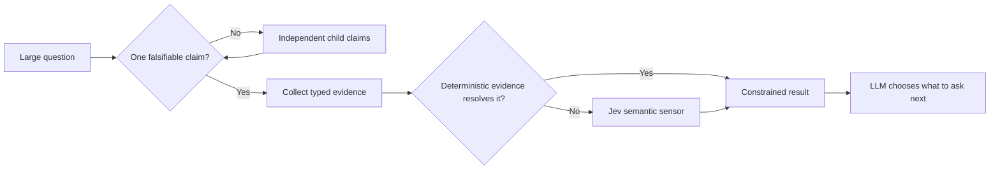

<p align="center">
  
</p>

<h1 align="center">Enzo</h1>

<p align="center"><strong>Turn big questions into small, falsifiable claims.</strong></p>

<p align="center">
  A minimal MCP server that applies decomposition pressure between an intelligent LLM and Jev.
</p>

<p align="center">
  <a href="https://github.com/mahawi1992/enzo-mcp/actions/workflows/ci.yml"></a>
  
  
  
  <a href="LICENSE"></a>
</p>

<p align="center">
  <a href="#why-enzo">Why Enzo?</a> ·
  <a href="#how-it-works">How it works</a> ·
  <a href="#quick-start">Quick start</a> ·
  <a href="#the-three-tools">Tools</a> ·
  <a href="#example">Example</a>
</p>

> **Enzo is not another autonomous-agent framework.** The LLM keeps responsibility
> for reasoning, strategy, and deciding what to investigate. Enzo makes each next
> question precise enough to test.

## Why Enzo?

The name is inspired by the Japanese Zen **ensō** (円相), the hand-drawn circle.
Enzo uses that image as a reasoning metaphor: begin with the large circle of a
problem, then reduce it into smaller circles until each contains exactly one
independently falsifiable claim.

```text
large question → smaller question → atomic claim → evidence → semantic result
```

Most reasoning systems are comfortable producing an answer. Enzo is designed to
apply pressure before that answer exists:

| Common failure | Enzo's response |
| --- | --- |
| One question hides several claims | Decompose it into independently testable atoms |
| Missing information becomes vague confidence | Return `UNKNOWN` with the exact gap |
| Semantic judgment overrides a test | Deterministic evidence remains authoritative |
| Conclusions lose their history | Preserve evidence, provenance, revisions, and dependencies |
| A tool quietly sends context outside the process | Require consent for every external Jev observation |

## How it works



The responsibilities stay deliberately separate:

| Component | Responsibility |
| --- | --- |
| **LLM** | Intelligence, strategy, interpretation, and choosing the next question |
| **Enzo** | Atomicity, evidence contracts, state transitions, and decomposition pressure |
| **Jev** | Typed semantic sensing against supplied context and evidence |
| **Deterministic tools** | Tests, schemas, AST inspection, type checking, and runtime measurements |

## Quick start

Requirements: Python 3.11+ and [uv](https://docs.astral.sh/uv/).

```bash
git clone https://github.com/mahawi1992/enzo-mcp.git
cd enzo-mcp
uv sync --group dev
uv run enzo-mcp
```

Jev is optional for deterministic workflows. To enable it, create a local `.env`
file containing:

```dotenv
TYPESAFE_API_KEY=your-key
```

The file is ignored by Git. Every external observation still requires
`allow_external_jev=true`; configuring a key alone never authorizes a send.

### Add Enzo to Codex

Add this to `~/.codex/config.toml`, replacing the path with your checkout:

```toml
[mcp_servers.enzo]
command = "uv"
args = ["run", "--env-file", ".env", "enzo-mcp"]
cwd = "/absolute/path/to/enzo-mcp"
```

Restart Codex. Enzo will expose exactly three tools.

## The three tools

| Tool | Purpose |
| --- | --- |
| `enzo_atomize` | Admit one atomic claim, safely decompose it, or request refinement |
| `enzo_observe` | Evaluate typed evidence and optionally invoke Jev with explicit consent |
| `enzo_state` | Return canonical investigation history, derived status, and the current frontier |

Atomicity has three outcomes:

- `ATOMIC` — one operationalized predicate can be evaluated independently.
- `DECOMPOSE` — multiple safe, explicit child claims can vary independently.
- `NEEDS_REFINEMENT` — the claim appears composite or vague, but a mechanical split
  could change its meaning.

Observation has four honest outcomes:

- `VERIFIED`
- `CONTRADICTED`
- `UNKNOWN`
- `INSUFFICIENT_EVIDENCE`

`UNKNOWN` is a useful result: it tells the LLM what must be learned next.

## Example

Ask Enzo to atomize a compound security question:

```json
{
  "request": {
    "root_goal": "Determine whether the production session cookie is hardened",
    "question": "Does the cookie set Secure and HttpOnly?",
    "subject": "the production session cookie",
    "predicate": "sets Secure=true; sets HttpOnly=true",
    "scope": "production session configuration",
    "expected_value": true,
    "evidence_requirements": [
      {
        "description": "Inspect the production cookie configuration",
        "accepted_kinds": ["SCHEMA_VALIDATION"],
        "deterministic_required": true
      }
    ],
    "verification_method": "SCHEMA_VALIDATION"
  }
}
```

Enzo returns `DECOMPOSE` and creates two independently falsifiable children:

```text
Does the production session cookie set Secure=true?
Does the production session cookie set HttpOnly=true?
```

Each child can now receive its own evidence, result, provenance, and parent impact.

## Jev integration

`PydanticJevSensor` uses Pydantic AI's TypeSafe provider and maps Enzo's answer
contracts to Jev primitives:

| Enzo answer type | Jev primitive |
| --- | --- |
| `BOOLEAN` | `Noul` |
| `CHOICE` | `Choice` |
| `SCORE` | `Score` |

Jev's native probability or confidence is preserved in sensor evidence. Enzo does
not manufacture an aggregate confidence score. A deterministic instrument is used
first whenever it can resolve the atom more reliably.

Prior sensor output is never sent back into a later Jev request, preventing semantic
feedback loops. Exact observation retries are idempotent, while dependency changes
correctly invalidate replayed results.

## Design principles

- One atom tests exactly one independently falsifiable semantic claim.
- Atomicity is semantic, not a measure of sentence length.
- Deterministic evidence outranks semantic judgment.
- Assumptions remain visibly distinct from facts.
- Parent conclusions are derived from their dependency graph.
- Contradictions remain explicit.
- Unknowns expose gaps instead of becoming invented certainty.
- The MCP surface stays small enough to understand.

## Development

```bash
uv sync --group dev
uv run ruff format --check .
uv run ruff check .
uv run mypy
uv run pytest
uv build
```

The current suite contains 54 tests covering contracts, atomicity, dependency
derivation, revision history, consent, Jev answer validation, replay safety, and the
stdio MCP surface.

## Privacy

Semantic observations are local-only by default. Setting
`allow_external_jev=true` authorizes that single request to send its supplied
context and evidence to TypeSafe/Jev. Redact credentials, personal data, and
unrelated sensitive information before enabling an external observation.

## Project status

Enzo is a focused v0.1 implementation. Its three-tool surface is intentional; the
contracts may evolve as real investigations expose better invariants.

Focused issues and pull requests are welcome. If the idea of turning large circles
into testable small ones is useful to you, consider starring the repository.

## License

[MIT](LICENSE) © 2026 Martin Harold Williams
